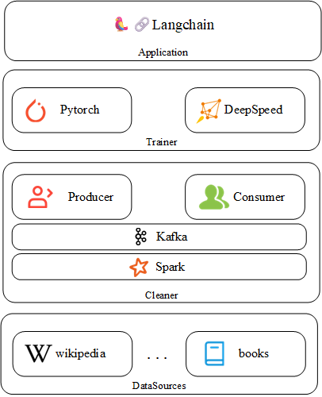

## Architecture
The over all architecture as depict in the following graph.

### Data Sources
The data sources is the database that you are going to conserve the database, the data source can be multi-modal, not only for
nautural language. But in this project implementation, we only implement the algorithm to reserve and process wikipedia.

And its data conserve system can be multiple, such as local file system or hdfs.

### Cleaner
This component is responsible to clean the data from datasources, you can load your dataset through spark. Preliminary clean
the data from datasources and deeper clean the data in consumer, or only use producer and ignore consumer to process in a step.
It depends on your need, if you are using producer and consumer architecture, you can use kafka as your message queue.

If you are instrest in wikicleaner, please refer to [wiki cleaner](../en/wiki_cleaner.md).
Or if you are insterest of how to custom your cleaner, please refer to...

### Trainer and Application
Those parts have not been complete, so I will not introduce it right now.